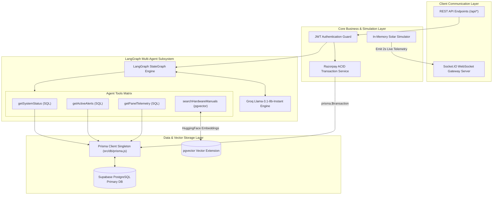
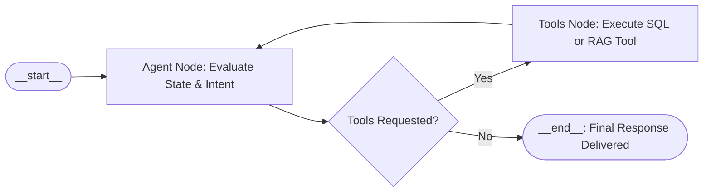
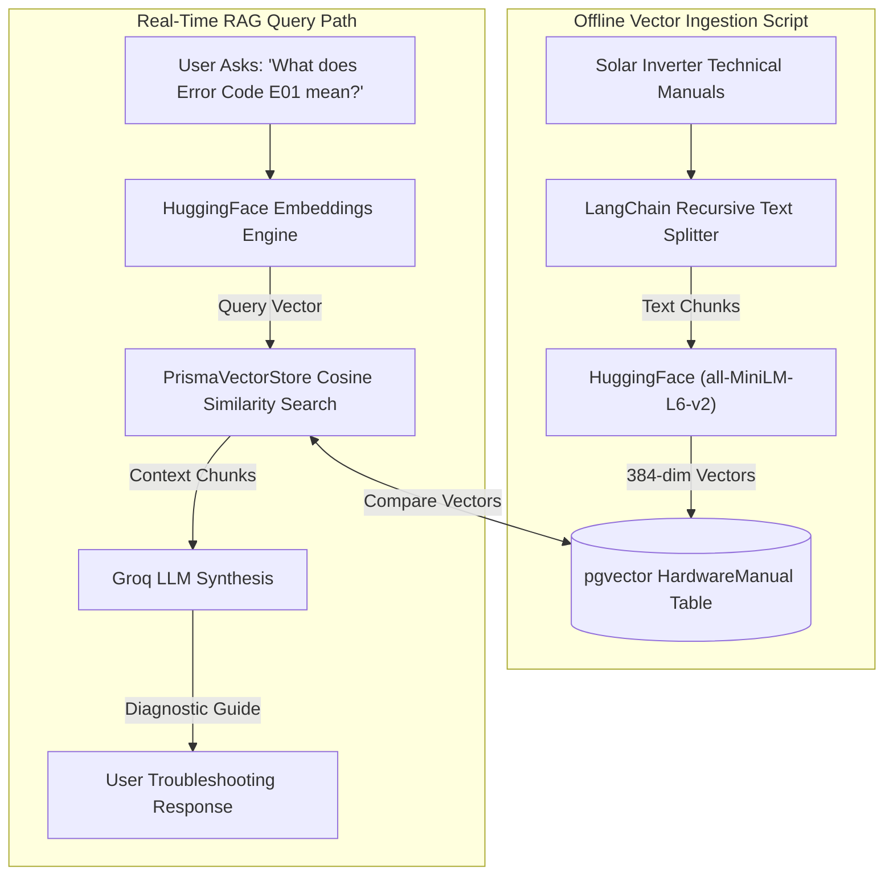
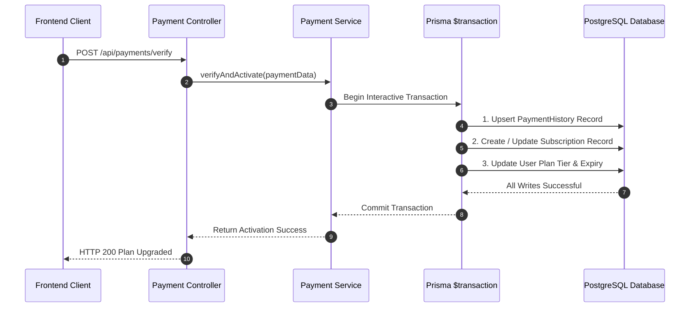

# ⚙️ GridSense Backend Subsystem — System Architecture Guide

> **Enterprise Node.js Backend with Socket.IO Real-Time Engine, LangGraph Multi-Agent Copilot, `pgvector` Hybrid RAG, and Prisma ACID Transactions.**

---

## 📐 Server Micro-Services & Gateway Flowchart



---

## 🤖 LangGraph Multi-Agent State Machine

The AI Copilot operates using a stateful directed graph compiled via `@langchain/langgraph`:



### 🛠️ Agent Tools Specification Matrix

| Tool Name | Technology | Inputs | Output Data |
| :--- | :--- | :--- | :--- |
| `getSystemStatus` | Prisma SQL | `userId` | System configuration, tier plan, total array count |
| `getActiveAlerts` | Prisma SQL | `userId` | List of active critical & warning alert records |
| `getPanelTelemetry` | Prisma SQL | `userId`, `panelName` (optional) | Real-time voltage, power, efficiency, fault state & alert details |
| `searchHardwareManuals` | `pgvector` + HuggingFace | `query` | Top 2 matching technical manual chunks via cosine similarity |

---

## 🔍 `pgvector` Hybrid RAG Embedding & Retrieval Pipeline



---

## 💳 ACID Transaction Execution Flowchart (`payment.service.js`)

To guarantee strict Consistency and Isolation across subscriptions, Razorpay payment verification uses Prisma interactive transactions:



---

## 🛡️ Database Connection Pool Optimization Strategy

To prevent connection handle exhaustion (`EMAXCONNSESSION`) on cloud PostgreSQL PgBouncer instances:

1. **Shared Database Singleton (`src/db/prisma.js`):** All services import a single shared `PrismaClient` instance instead of spawning duplicate connection pools.
2. **In-Memory Telemetry Aggregation (`src/simulator/panel.simulator.js`):** Real-time 2-second simulation ticks compute metrics in-memory, eliminating 2,880 queries/hour per user.
3. **Short-Circuited Normal Panel AI Analysis (`src/services/ai.service.js`):** Healthy solar panels ($\ge 85\%$ efficiency) generate normal status reports in-memory, reducing Groq LLM token consumption by **99.5%**.

---

## 🧪 Testing Suite Execution

Run automated unit and integration tests:

```bash
# Navigate to server directory
cd server

# Run Jest test suites
npm run test
```

**Expected Output:**
```text
PASS tests/integration/copilot.routes.test.js
PASS tests/unit/copilot.service.test.js

Test Suites: 2 passed, 2 total
Tests:       4 passed, 4 total
Time:        2.361 s
```
