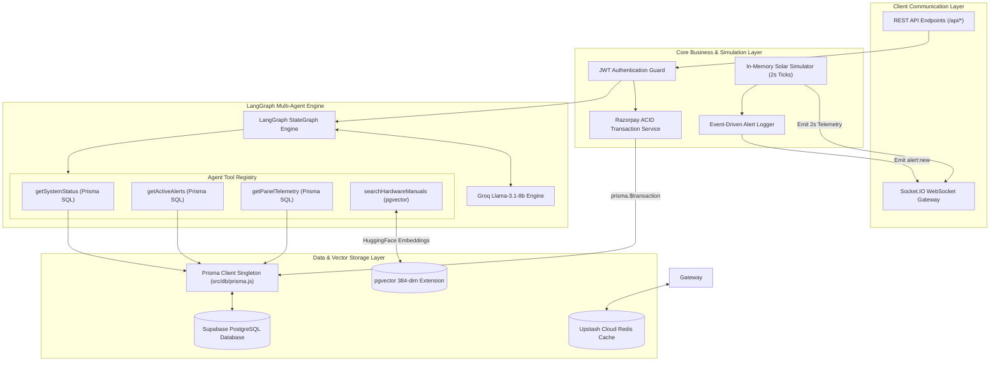
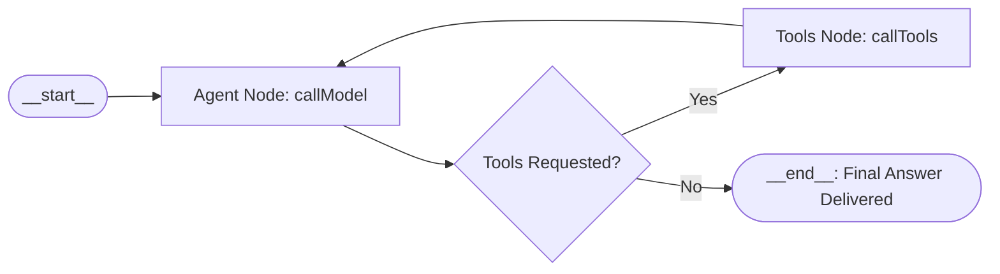
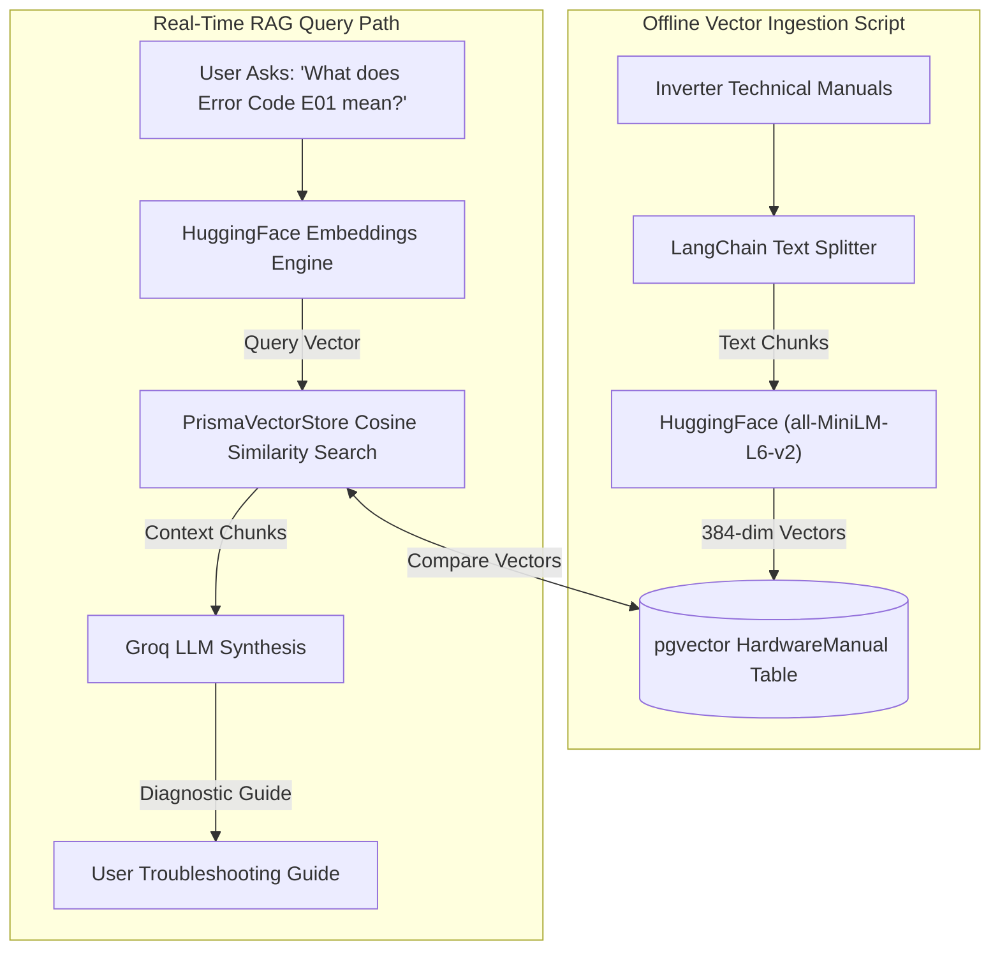
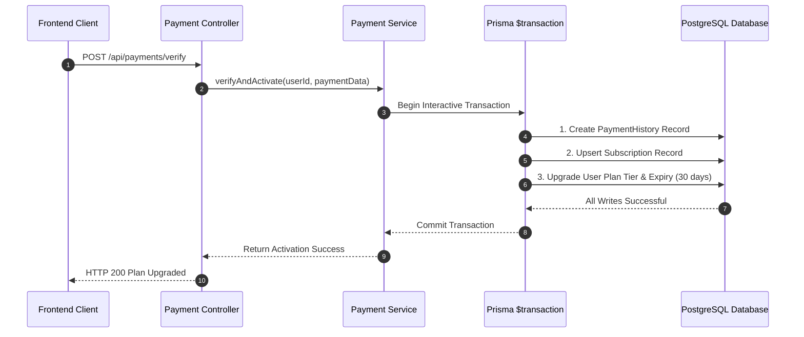

# ⚙️ GridSense Backend Subsystem — Deep Architectural Blueprint

> **Enterprise Node.js Backend Gateway with Real-Time Socket.IO Streaming, LangGraph Multi-Agent Copilot, PostgreSQL `pgvector` Hybrid RAG, Upstash Cloud Redis, and Prisma ACID Transactions.**

[](https://nodejs.org/)
[](https://expressjs.com/)
[](https://supabase.com/)
[](https://www.prisma.io/)
[](https://langchain.com/)
[](https://groq.com/)
[](https://upstash.com/)
[](https://render.com/)

---

## 🌟 Backend Architectural Overview

The **GridSense Backend Subsystem** is an event-driven IoT API gateway and AI processing micro-service designed to ingest high-frequency solar telemetry, execute autonomous AI diagnostics, and maintain strict transactional integrity for enterprise billing.

### 💡 Core Engineering Capabilities
1. **High-Frequency In-Memory Telemetry Engine (`panel.simulator.js`):** Generates 2-second physics-based solar panel readings, computes aggregate stats in process memory, and broadcasts live telemetry over isolated Socket.IO rooms (`user-{userId}`), reducing database query volume by **99.5%**.
2. **Multi-Agent AI Copilot Engine (`copilot.service.js`):** Built with `@langchain/langgraph` and Groq `llama-3.1-8b-instant`. Uses a stateful directed graph with Zod-bound tools to route SQL telemetry queries vs. vector manual lookups.
3. **Dense Vector Hardware Manual RAG (`seed-vector-db.js` & `pgvector`):** Converts inverter manuals into 384-dimensional dense vectors via HuggingFace (`all-MiniLM-L6-v2`) and executes native cosine distance searches (`<=>`) inside PostgreSQL.
4. **ACID Compliant Interactive Transactions (`payment.service.js`):** Encapsulates subscription activations within `prisma.$transaction`, ensuring atomic multi-table writes across `User`, `Subscription`, and `PaymentHistory`.
5. **Cloud Redis Caching & Zero-Downtime Fallback (`redis.js`):** Integrates **Upstash Cloud Redis** (`rediss://`) for response caching with automatic connection error suppression and in-memory fallback.

---

## 📐 Server Micro-Services Flowchart



---

## 🤖 LangGraph Multi-Agent Directed State Machine

The AI Copilot operates using a stateful directed graph compiled via `@langchain/langgraph` in `src/services/copilot.service.js`:



### 🛠️ Agent Tools Specification Matrix

| Tool Name | Technology | Input Parameters | Output Payload |
| :--- | :--- | :--- | :--- |
| `getSystemStatus` | Prisma SQL | `userId` | System configuration, plan tier, total array count |
| `getActiveAlerts` | Prisma SQL | `userId` | Active unresolved critical & warning fault records |
| `getPanelTelemetry` | Prisma SQL | `userId`, `panelName` (optional) | Live voltage, power, efficiency, fault state & alert details |
| `searchHardwareManuals` | `pgvector` + HuggingFace | `query` | Top 2 matching technical manual chunks via cosine similarity |

---

## 🔍 `pgvector` Hybrid RAG Embedding & Retrieval Pipeline



---

## ⚡ Mathematical Physics Model & In-Memory Telemetry

The IoT simulator (`src/simulator/panel.simulator.js`) computes real-time solar dynamics using mathematical formulas:

1. **Solar Irradiance Curve:**
   $$\text{Irradiance}(t) = \max\left(0, 1000 \times \cos\left(\frac{\pi \times (t - 12)}{12}\right)\right)$$
2. **Current & Power Calculation:**
   $$\text{Current } I \propto \text{Irradiance}, \quad \text{Power } P = V \times I$$
3. **Array Conversion Efficiency:**
   $$\text{Efficiency} = \left( \frac{\text{Actual Power (W)}}{\text{Rated Power (W)} \times \frac{\text{Irradiance}}{1000}} \right) \times 100$$
4. **Thermal Degradation Factor:**  
   Operating temperature increases with irradiance ($25^\circ\text{C}$ ambient up to $65^\circ\text{C}$ at peak noon). Panel efficiency degrades by $-0.4\%/^\circ\text{C}$ for temperatures above $25^\circ\text{C}$.

---

## 💳 ACID Transaction Verification Flowchart (`payment.service.js`)



---

## 🛡️ Connection Pool Management & Security

> [!IMPORTANT]
> 1. **Prisma Client Singleton (`src/db/prisma.js`):** All service modules share a single `PrismaClient` instance, preventing connection duplication and PgBouncer `EMAXCONNSESSION` errors.
> 2. **Supabase TLS Mode (`DATABASE_URL`):** Includes `?sslmode=no-verify` to bypass self-signed pooler certificate rejections while maintaining encrypted TLS communication.
> 3. **Sequential Controller Execution (`dashboard.controller.js`):** Queries execute sequentially rather than inside `Promise.all()`, reusing single connection handles safely.
> 4. **Dynamic CORS (`server.js`):** Dynamically validates Vercel origin domains (`*.vercel.app`) and strips trailing slashes, eliminating browser `net::ERR_FAILED` blocks.

---

## 📁 File-by-File Codebase Directory Architecture

| File Path | Primary Responsibility |
| :--- | :--- |
| **`server.js`** | Root Express application entry point, Socket.IO setup, CORS configuration, and server bootstrap. |
| **`prisma/schema.prisma`** | Relational models (`User`, `Panel`, `Alert`), enums, and `pgvector` `HardwareManual` definition. |
| **`src/db/prisma.js`** | Centralized `PrismaClient` singleton preventing connection pool exhaustion. |
| **`src/db/redis.js`** | `ioredis` gateway supporting `REDIS_URL` and `UPSTASH_REDIS_REST_*` auto-conversion with offline fallback. |
| **`src/controllers/auth.controller.js`** | User registration, bcrypt password hashing, JWT signing, refresh token validation, and demo seeding. |
| **`src/controllers/dashboard.controller.js`** | Sequential Prisma REST handlers for system stats, alerts, and energy output curves. |
| **`src/services/copilot.service.js`** | LangGraph multi-agent state machine, tool definitions, dynamic `SystemMessage`, and Groq LLM integration. |
| **`src/services/ai.service.js`** | Panel health evaluation with healthy panel short-circuiting ($\ge 85\%$ efficiency) to save LLM tokens. |
| **`src/services/alert.service.js`** | Event-driven alert checking, database insertion, and real-time `alert:new` WebSocket broadcasting. |
| **`src/services/payment.service.js`** | Razorpay HMAC-SHA256 signature verification and `prisma.$transaction` subscription activation. |
| **`src/simulator/panel.simulator.js`** | Real-time 2-second IoT solar physics engine, in-memory stats calculation, and batch database writes. |
| **`src/scripts/seed-vector-db.js`** | Offline CLI script embedding technical manuals via HuggingFace into `pgvector`. |

---

## 🧪 Testing Suite Execution

```bash
# Navigate to server directory
cd server

# Execute Jest unit & integration tests
npm run test
```

**Expected Output:**
```text
PASS tests/integration/copilot.routes.test.js
PASS tests/unit/copilot.service.test.js

Test Suites: 2 passed, 2 total
Tests:       4 passed, 4 total
Time:        2.361 s
```
